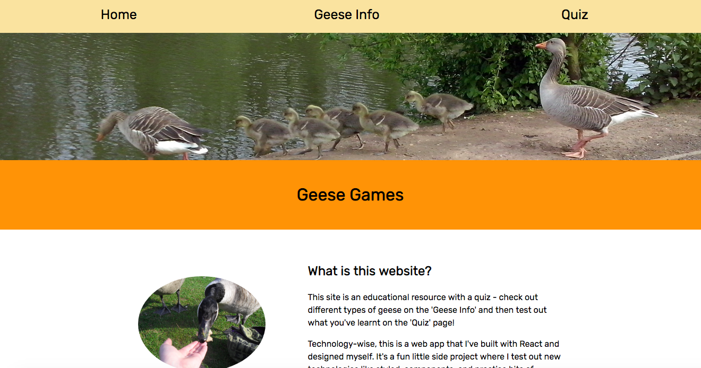
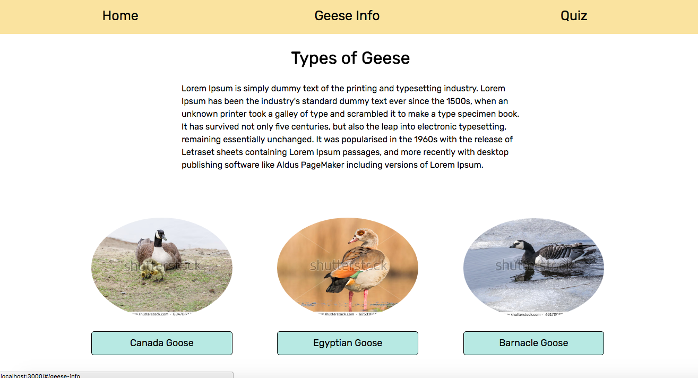
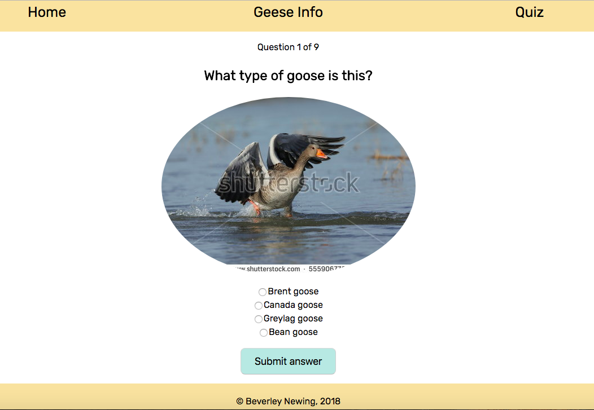

# Geese Games

## What is this app?
I really love geese, which are totally underrated and underappreciated animals in my opinion... So I thought I'd write a light-hearted little information and quiz site about them, to help me learn how to use [React](https://reactjs.org/). I also wanted to play with [Styled Components](https://www.styled-components.com/).

## Tech Stack
- React
- Styled-components
- govuk-react

## How to work with this project
- Once you've cloned it down, run `npm install` to get all the appropriate modules
- Then, run `npm run start` to start the local server and navigate to the port it tells you to go to
- Once you're ready to deploy, push up GitHub and merge into the master branch if you weren't on master, then run `npm run deploy`

## Resources

After asking around, I was recommended and then got Wes Bos' [reactforbeginners.com](reactforbeginners.com) course to get me started. Then, when I started up this project, I often referred to the [Facebook documentation](https://facebook.github.io/react/docs/hello-world.html). I used [create-react-app](https://github.com/facebookincubator/create-react-app) to start me off. 

## Plans for this app
- More information about the different types of geese on the geese info page
- Make the quiz order randomised and quiz answer options shuffle 

## Issues
If you see any issues with my code, please do raise issues on the repo! Any feedback or tips are greatly appreciated =) 

## Screenshots

Homepage:

Geese info page:

Quiz page:
